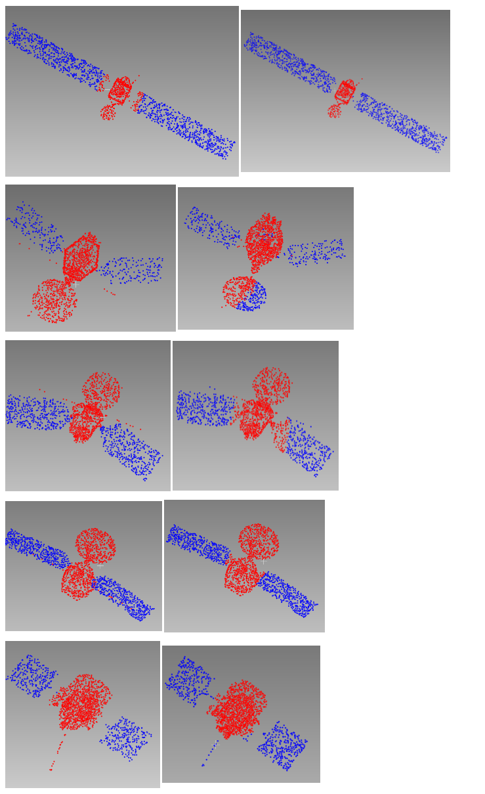

# 周报250610

本周转换自己的数据集格式，调整代码框架跑了卫星的分割任务

|   DGCNN   |   loss   |   acc    | avg acc  |   iou    |
| :-------: | :------: | :------: | :------: | :------: |
| **train** | 0.035500 | 0.987808 | 0.986318 | 0.986934 |
| **test**  | 0.438242 | 0.808879 | 0.791141 | 0.830947 |

##### train loss 很小，test loss 偏大，出现典型的过拟合现象。--->  正在尝试增加数据增强、使用正则化；

##### test acc 与 train acc 差距较大,模型记住了训练数据，泛化能力略差 --> 准备增加训练数据；

##### IoU 表现良好（test IoU = 0.83）,分割任务表现不错，进一步优化尽量提升至90%。

