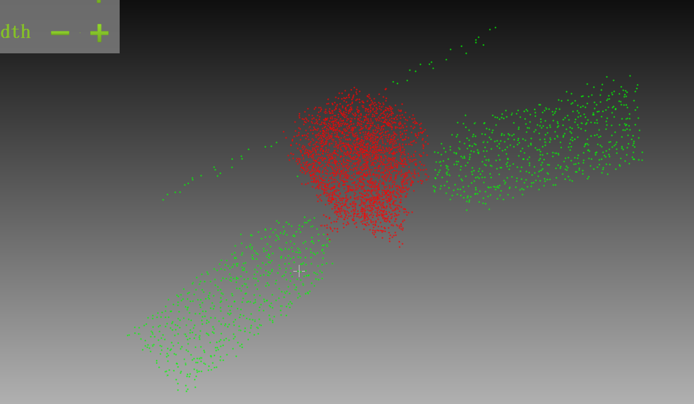
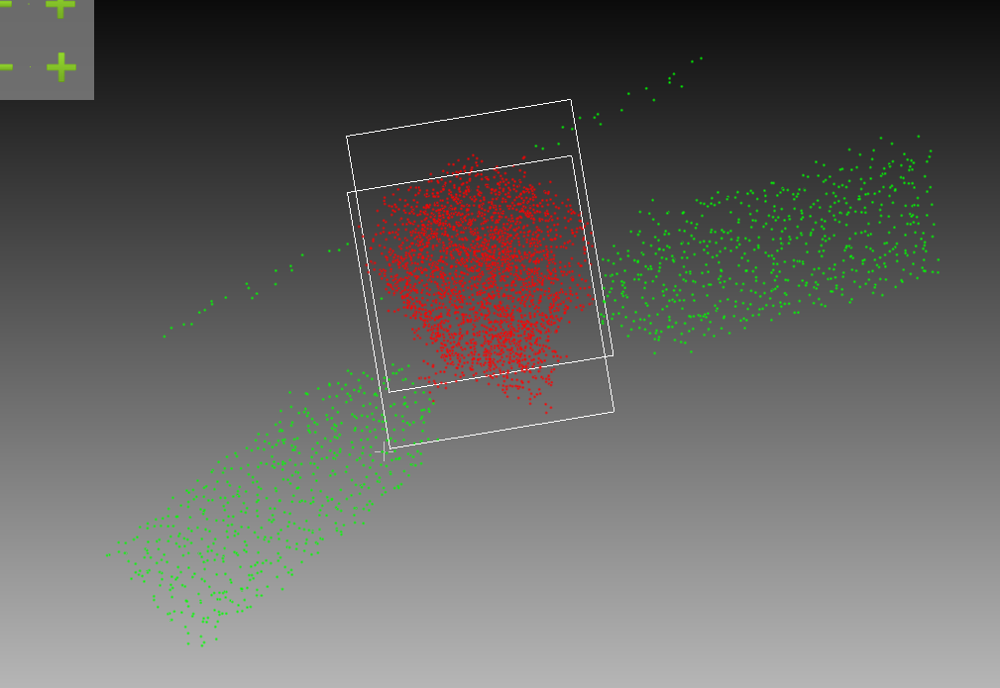
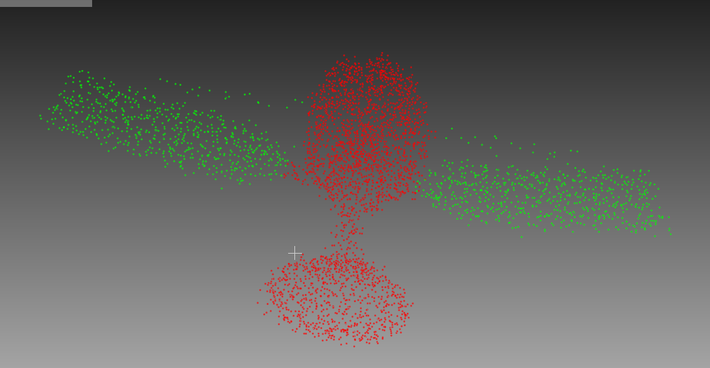
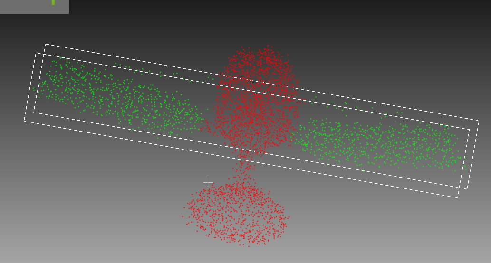
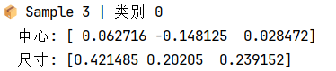
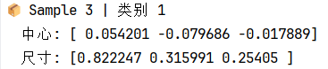
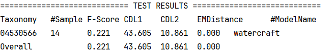
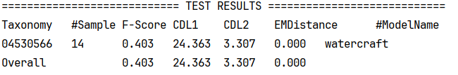
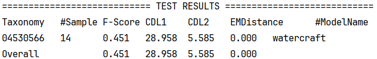
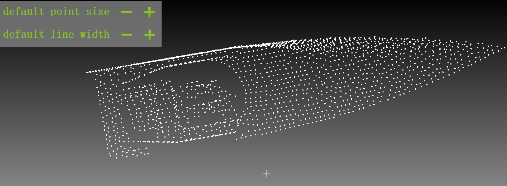

# 周报250626

### 1. 最小包围盒

卫星翅膀和主体用最小包围盒框选，并打印出中心和尺寸大小

###### 

### 2. 点云补全

将PCN解码器替换成 SnowflakeNet解码器，Snowflake 这类多层解码器提供了更加结构清晰、边缘明确的中间特征，有利于其逐级还原过程。**效果一般**

在更改网络的过程中重新仔细检查了一遍我的数据集，发现数据集的问题：

1. **数量不够**；官方的数据集每个类别的训练集里面有超过  8*1500=12000  个 .pcd 点云文件，把我的数据集掺杂在官方数据集（使数据量增加），训练效果明显变好；把官方的数据集减少到跟我一样，训练数据也很差。再把我的数据集double重新训练，在相同参数下(AdaPoinTr原始参数) 明显变好, 但是上限稳定在 Fscore = 0.45 左右，因为我的数据集是重复的，量变质不变，限制了性能上限。

   目前就是收集了一些数据还在跑，下周会持续收集一些数据，通过增加卫星和增加残缺点云数量的方式来扩大数据集。

   

2. 跟官方的点云进行可视化对比，缺失点云的采样方式有区别，官方的采样比较均匀，而我的采样相对比较随机。

#####   			    官方采样

##### 				我的采样

### 后续工作

1. 通过增加卫星数量和增加残缺点云数量的方式来扩大数据集；
2. 修改残缺点云采样使得更均匀；
3. 看论文找找思路。