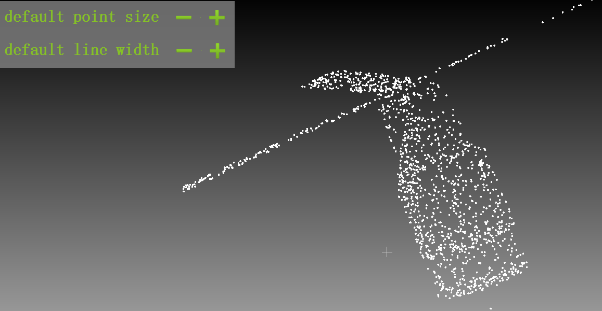
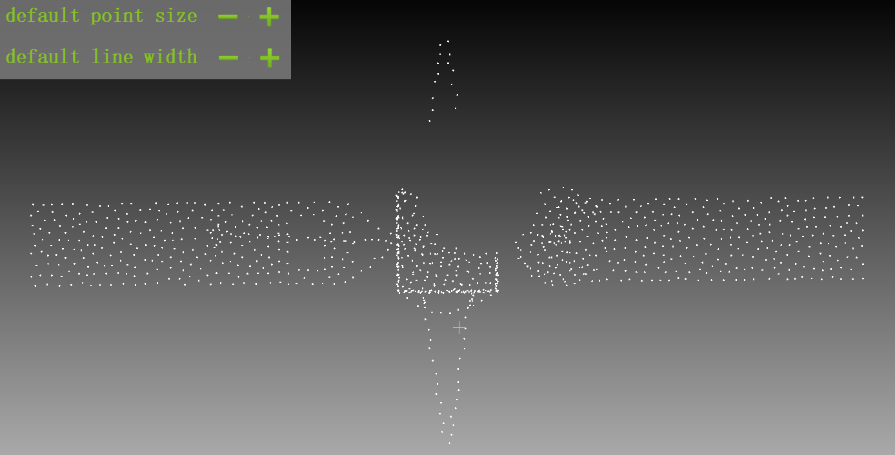
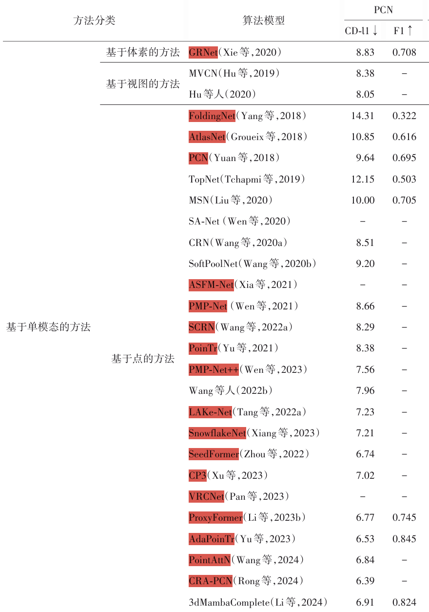
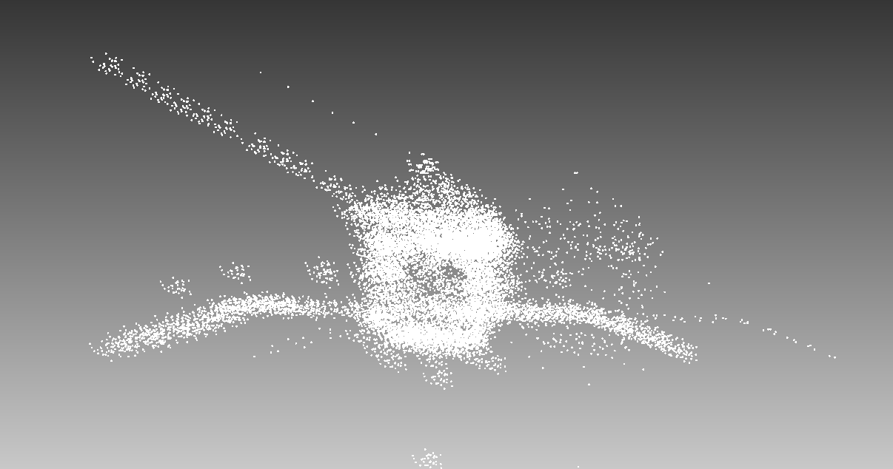
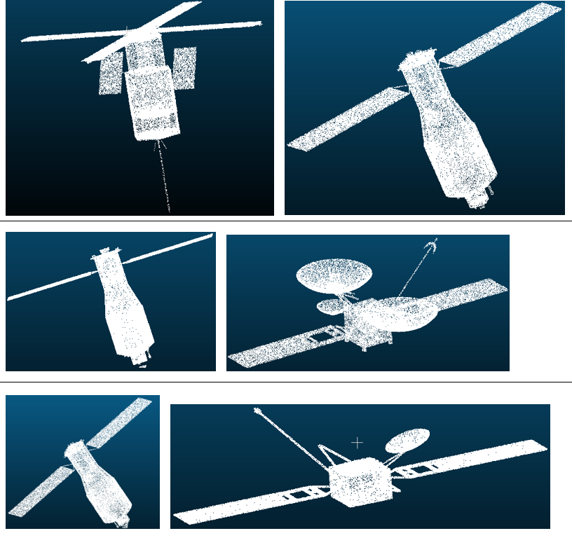
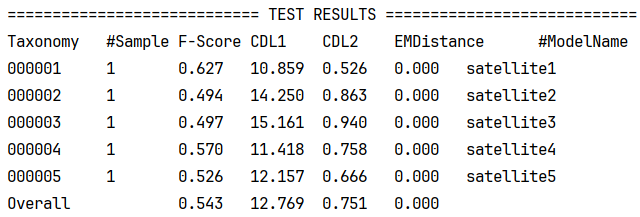

## 周报250707

1. #### 点云补全

   跟官方的点云进行可视化对比，缺失点云的采样方式有区别，官方的采样比较均匀，而我的采样相对比较随机。修改了我的采样方式

#####   			    官方采样

##### 				我的采样（前）

**我的采样**（**后**）

把我的数据集用不一样的残缺方式扩充到了70*100=7000个，修改了采样方式，变得更加均匀。训练600轮之后的F-Score = 0.735，CDL1 = 9.9，CDL2 = 0.652， 说明更改  更加均匀的采样方式＋添加点云视角 效果还是可以的，至少在F-Score这一参数上已经比一些模型要好，但是比最好的模型还是差0.11，CDL1 和 CDL2 相对来说要差得多一些。 说明**整体结构还原方面**表现较好（F-score 高）；但在 **局部精度、细节还原方面 **存在较大提升空间（CD-L1 较大）。

​                                                                                 整体结构还原还可以；但在噪声较大，细节补全得不是很好。

我的数据集只分了一个类别，类别下每个卫星的形状相差比较大。官方数据集差别不大。

分类处理; 将形状相似的归于一个类别下，但是能归类的模型大概只有一半，其他的都太复杂太个性。最后训练出来的结果F-Score = 0.543。可能还是跟数据量有关? 

增加每个类别残缺的数量到500，**结果相差不大**。

##### 我的想法：

1. 不用找这么多类似的卫星，把每个卫星用3DMAX做一些小处理之后，比如细小的移位和残缺，输出为一个新的卫星，这样就能得到很多形状相似但是又不至于相差太大的同类卫星。
2. 用多模态输入的网络或者添加预训练模型。

