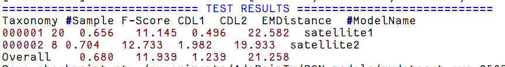
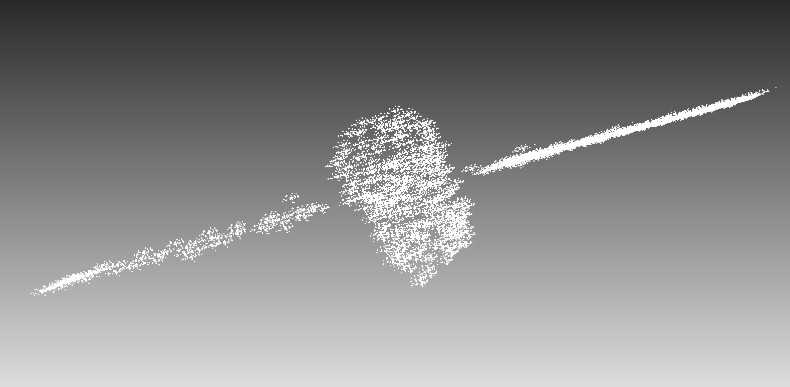
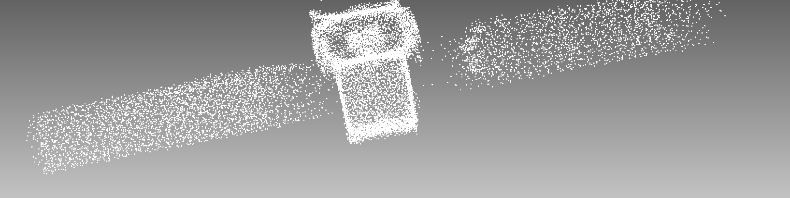
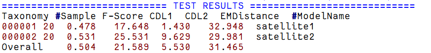
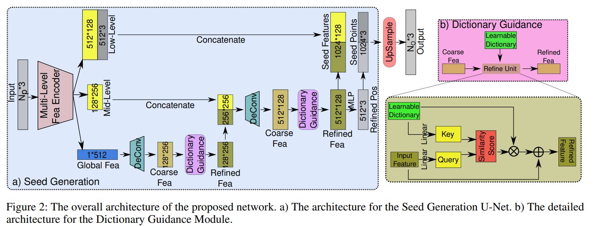
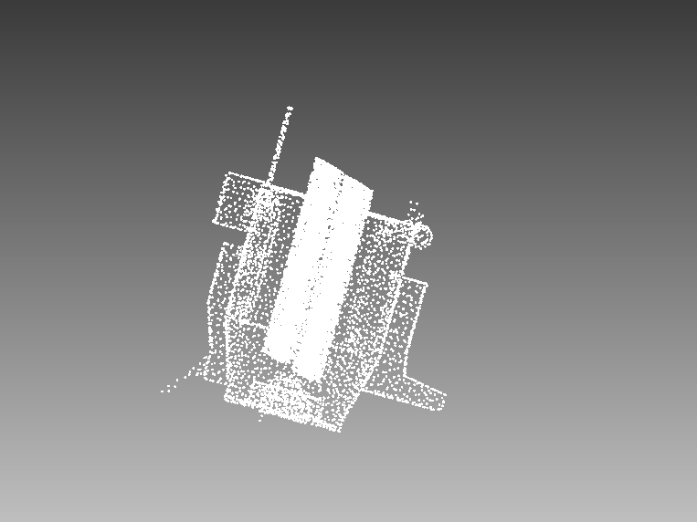
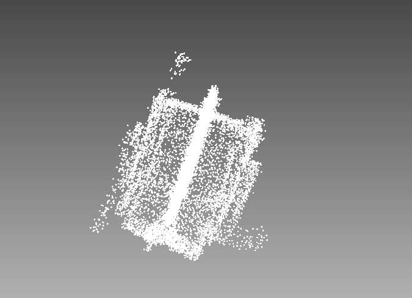
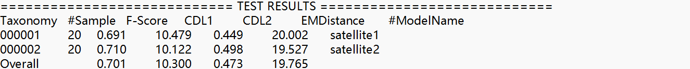

## 组会250902

#### 点云补全

1. ##### 修改损失函数

| 目标           | 损失函数           | 权重       |
| -------------- | ------------------ | ---------- |
| 整体形状匹配   | Chamfer L1         | `1.0`      |
| 精细结构优化   | Chamfer L2         | `0.1 `     |
| **点密度优化** | **EMD**            | **`0.05`** |
| 边界连续性     | Denoise Chamfer L1 | `0.3`      |

保证整体形状匹配，进行结构细化，匹配点云自然密度分布，提高补全边界的过渡性

**结果：密度均匀很多，结构边缘更加分明**

**2.觉得双叶卫星数量太少，添加数量**

| Experiment | Model   | F-Score | CDL1   | CDL2  | EMDistance |
| ---------- | ------- | ------- | ------ | ----- | ---------- |
| Exp1       | Overall | 0.68    | 11.939 | 1.239 | 21.258     |
| Exp2       | Overall | 0.504   | 21.589 | 5.53  | 31.465     |

##### 3. 添加结构先验字典

### Orthogonal Dictionary Guided Shape Completion Network for Point Cloud Pingping Cai, Deja Scott, Xiaoguang Li, Song Wang（AAAI-2024）

作者提出基于结构子空间学习的补全先验，有效提升模型对缺失区域结构理解。

**Dictionary Guidance Module**

从训练数据中学习到一组可区分的形状基，输入 coarse feature，与字典特征计算相似度得到Similarity Score，相似度分数越高加权越高，最后结果由字典加权生成。

在 AdaPoinTr 中 decoder 输出后加入 `Dictionary Guidance Module`；

增强模型对缺失区域的结构理解与细节还原能力;

| Experiment | Model      | F-Score ↑ | CDL1 ↓  | CDL2 ↓ | EMDistance ↓ |
| ---------- | ---------- | --------- | ------- | ------ | ------------ |
| Exp2       | satellite1 | 0.478     | 17.648  | 1.43   | 32.948       |
| Exp2       | satellite2 | 0.531     | 25.531  | 9.629  | 29.981       |
| Exp2       | Overall    | 0.504     | 21.589  | 5.53   | 31.465       |
| Exp3       | satellite1 | 0.691↑    | 10.479↓ | 0.449↓ | 20.002↓      |
| Exp3       | satellite2 | 0.71↑     | 10.122↓ | 0.498↓ | 19.527↓      |
| Exp3       | Overall    | 0.701↑    | 10.3↓   | 0.473↓ | 19.765↓      |

**结果在边缘、结构突起等结构还原更完整、不失真。**

**对拐角、轮廓等细节结构的还原更加完整。**

3. ##### **加权正样本处理**

    **从200轮之后**开始，而不是在训练的最开始。训练初期**通常会遇到不稳定性较高，模型的表现较差，采用的策略是**延迟加权处理，让模型先学习到基础的结构，然后在模型已经有了一定的学习能力后，再增强对正样本的学习。

| Experiment | Model      | F-Score | CDL1   | CDL2  | EMDistance |
| ---------- | ---------- | ------- | ------ | ----- | ---------- |
| Exp3       | satellite1 | 0.691   | 10.479 | 0.449 | 20.002     |
| Exp3       | satellite2 | 0.71    | 10.122 | 0.498 | 19.527     |
| Exp3       | Overall    | 0.701   | 10.3   | 0.473 | 19.765     |
| Exp4       | satellite1 | 0.689   | 10.469 | 0.445 | 19.604     |
| Exp4       | satellite2 | 0.735   | 9.711  | 0.491 | 18.337     |
| Exp4       | Overall    | 0.712   | 10.09  | 0.468 | 18.97      |

