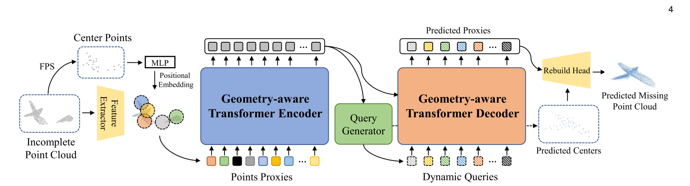
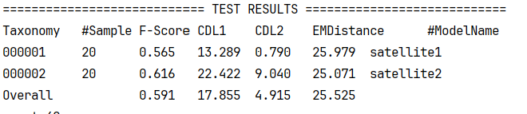
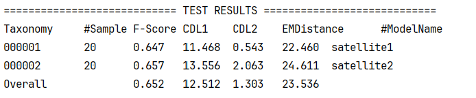
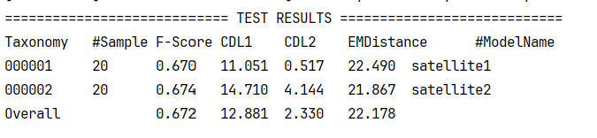
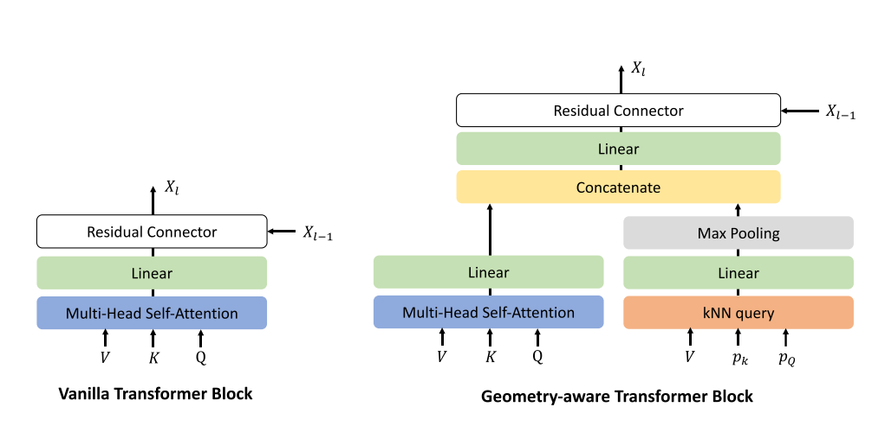
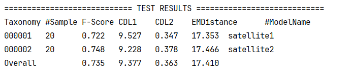
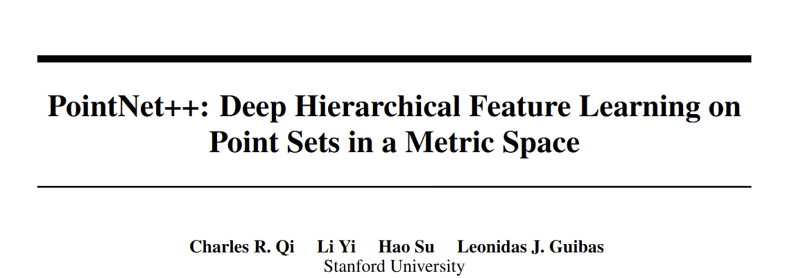

## 组会

**框架**

#### 1.  改变KNN，用其他RPE-3D

KNN 在几何感知模块中的作用： 注意力是通过特征相似度来计算的。但点云是空间数据，如果只靠特征，很容易忽略点的几何邻接关系。KNN能够保证模型局部几何连续性。

**RPE-3D** ：点与点之间的**相对位置编码**引入注意力权重，但是这个更注重全局的几何关系。

​															**AdaPointr（KNN）**

​															**AdaPointr(RPE-3D)**

| Metric         | Before | After                |
| -------------- | ------ | -------------------- |
| **F-Score**    | 0.591  | 0.652 **(+10.32%)**  |
| **CDL1**       | 17.855 | 12.512 **(+29.93%)** |
| **CDL2**       | 4.915  | 1.303 **(+73.49%)**  |
| **EMDistance** | 25.525 | 23.536 **(+7.79%)**  |

**CDL2**有极大提升：距离很远的异常点的误差少了，远距离异常点少了。

加入之前改好的模型中

​											**AdaPointr（KNN）+DicGuid+正样本加权**  

​											**AdaPointr(RPE-3D)+DicGuid+正样本加权**

| Metric         | Before | After                |
| :------------- | :----- | :------------------- |
| **F-Score**    | 0.707  | 0.672 **(-4.95%)**   |
| **CDL1**       | 9.953  | 12.881 **(-29.42%)** |
| **CDL2**       | 0.413  | 2.330 **(-464.41%)** |
| **EMDistance** | 18.947 | 22.178 **(-17.05%)** |

**1+1<2**

#### 2. 不改变KNN，改变拼接方式：几何-语义加权融合替代简单拼接

目前是**全局注意力分支**和**几何分支**直接拼接融合。把输出改成门控融合，按比例融合**全局注意力分支**和**几何分支**的特征，这个比例会根据loss的计算慢慢调整。

​												**AdaPointr（KNN）+DicGuid+正样本加权  (A)**

​                                                 						**AdaPointr（KNN）+DicGuid+正样本加权+门控 (B)**

| Metric     | Before (A) | After (B)            |
| ---------- | ---------- | -------------------- |
| F-Score    | 0.707      | 0.735  **(+3.96%**)  |
| CDL1       | 9.953      | 9.377  **(+5.79%)**  |
| CDL2       | 0.413      | 0.363  **(+12.11%)** |
| EMDistance | 18.947     | 17.41  **(+8.11%**)  |

#### 3. 想法

####   

#### 

**尝试：** **固定数据量——>固定空间尺度（半径）**