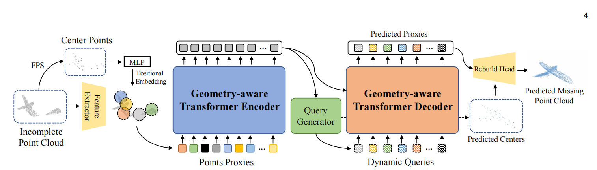
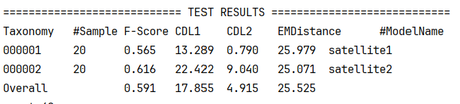
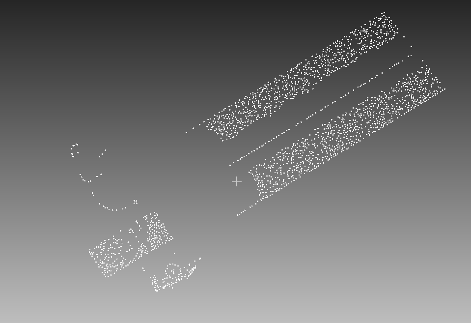
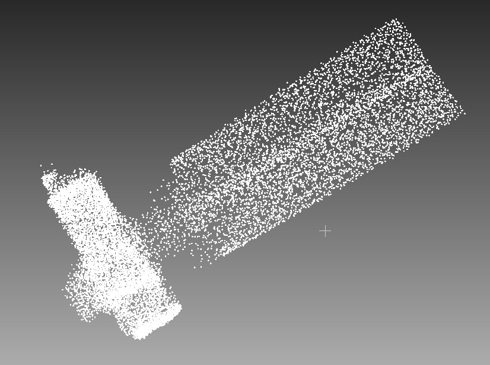
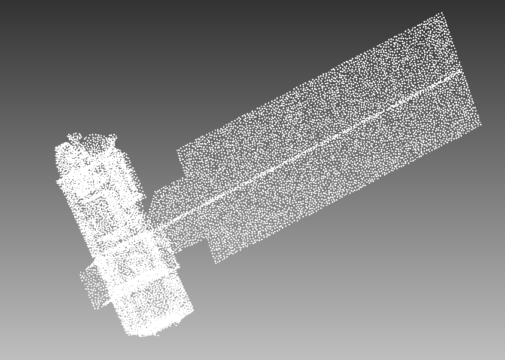
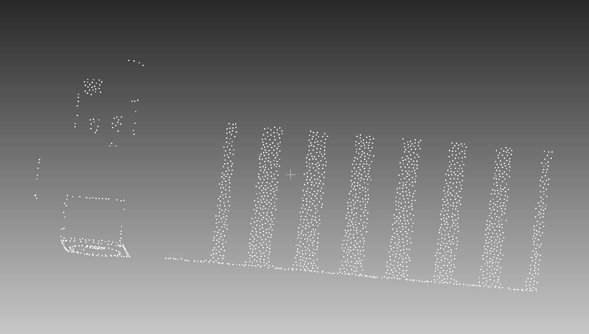
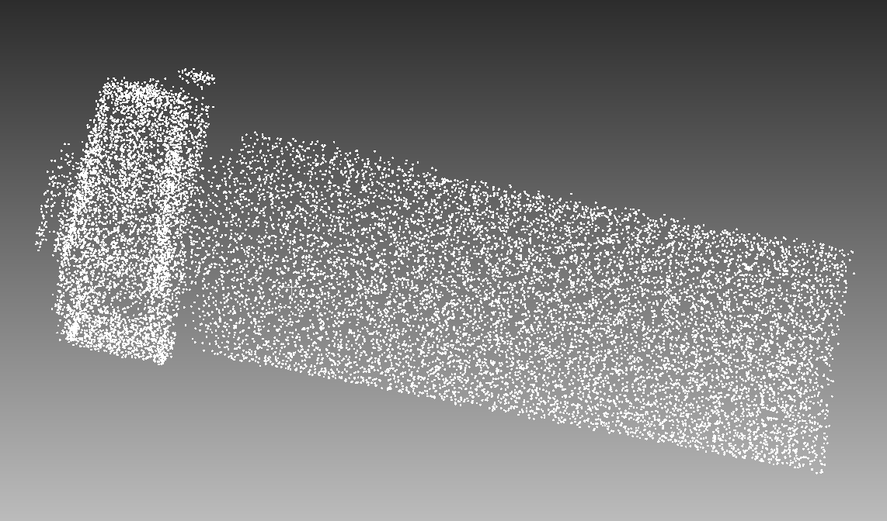
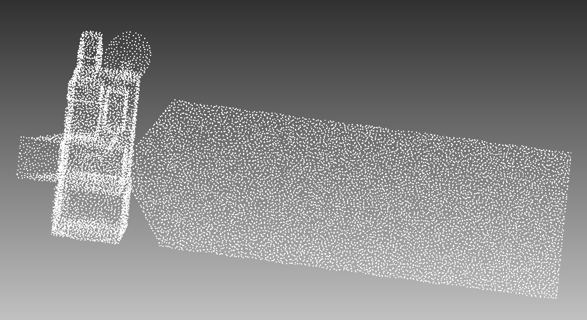

## 组会250924

#### 1. 结构调整

球状查询：围绕某个中心点，以半径 r 画一个球，选取所有落在这个球内的点，作为该点的局部邻域。

​																前

​																后

BallQuery  模型在精度和细节复原上得到了改善。**局部细节** 和 **全局结构** 都有改进。

#### 2. 对比实验

|       | DicGuid | SampleChosen | Gate  | BallQuery | F-Score   | CDL1      | CDL2      | EMDistance |
| ----- | ------- | ------------ | ----- | --------- | --------- | --------- | --------- | ---------- |
| A     |         |              |       |           | 0.591     | 17.855    | 4.915     | 25.525     |
| B     | √       |              |       |           | 0.701     | 10.300    | 0.473     | 19.765     |
| C     | √       | √            |       |           | 0.707     | 9.953     | 0.413     | 18.947     |
| **D** | **√**   | **√**        | **√** |           | **0.725** | **9.485** | **0.369** | **17.354** |
| E     |         |              |       | √         | 0.600     | 16.847    | 4.462     | 24.026     |
| F     |         | √            | √     |           | 0.708     | 10.252    | 0.493     | 18.753     |
| G     |         |              |       | √         | 0.600     | 16.847    | 4.462     | 24.026     |
| H     | √       | √            | √     | √         | 0.682     | 10.589    | 0.483     | 19.502     |
| I     |         | √            |       |           | 0.626     | 13.539    | 0.854     | 23.661     |
| J     | √       |              | √     |           | 0.623     | 13.363    | 0.728     | 24.892     |
|       |         |              |       |           |           |           |           |            |

**总结：**

​	对比得出的结论是Dictionary Guidance这是最大、最稳定的增益，把整体误差直接拉低一大截。（A→B）

​	Gate **需要与SampleChosen 配合**才能发挥正面效果，单配 Dictionary Guidance容易伤到效果（门控把字典带来的强先验“稀释”了）。

​	单独使用SampleChosen 增益中等且稳定（A→I）。

​	BallQuery：单用小幅提升；**叠加后会有点拖后腿。**（后续调参试试）

​	**DicGuid + SampleChosen + Gate（ D）**。这是当前最优指标。

**目前最好指标跑出来的结果：**

**不足**：

   总的来说，和完整点云对比，一些局部结构没有恢复出来，外形圆滑但比较粗糙。

**原因：**

​    样本不够丰富，我的样本是由一个样本手动删减局部得到多个样本，相似度相对参考数据集来说肯定偏高，缺乏形状多样性，容易生成悬空点，对细节泛化不好。

#### 3. 下周计划

BallQuery  参数调整

多加几个评价指标

试试总体还能不能微调（主要关注局部细节补全）

​	...

