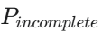
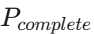

### 周报251105

#### 论文：按照之前的讨论，先整合手头的已经有的工作，不需要大篇幅地修改当前的初稿，投偏cv的文章

1. Introduction

2. 相关工作

   **2.1 空间目标残缺数据的来源与表征**

   ​	综述残缺数据的两种主要来源：(1) 真实时序观测序列的重建（如 SfM, MVS, ICP/SVD）；(2) 仿真模拟生成（基于 CAD 模型） 。并指出两者间的“域差异”挑战 。

​	**2.2  空间目标点云补全的迫切性与独特挑战**

​	论述空间目标补全的必要性 ，并详尽分析其面临的三大独特挑战：（1）极端稀疏与不完整性；(2) 特殊且精细的几何结构（如薄板、细杆）；(3) 高质量标注数据的匮乏 。

​	2.3  通用点云补全方法及其在空间目标应用上的局限性

​	2.4 Transformer 架构在点云补全中的演进与新挑战

3. 方法

​	**3.1 问题定义与观测序列预处理**

​	定义本文的输入，即模拟真实观测，通过 SVD-ICP 算法对多帧时序序列进行配准与融合后，所得到的仍不完整的点云 。网络任务是将其恢复为。

​	3.2 总体架构

​	......

4. 实验

​	数据集

​	**Satellite** **数据集**：基于 SVD 序列融合，构成了具有不同缺失程度、且贴近真实观测场景的残缺输入，介绍数据集数量

​	**4.1  宏观几何结构补全性能评估**

​	OOBB 姿态误差：用于计算补全点云相对于输入点云包围盒的主轴角度差 。
​	OOBB 尺度误差：用于计算补全点云相对于输入点云的包围盒边长平均 L1 相对误差。

5. 结论

