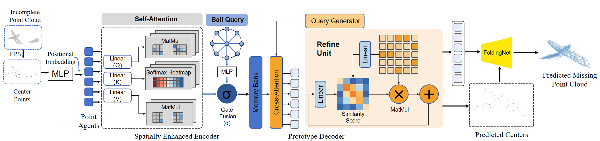
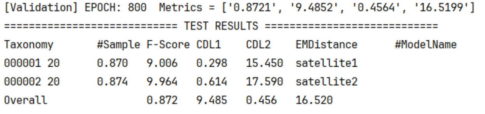
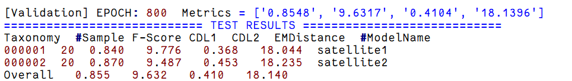
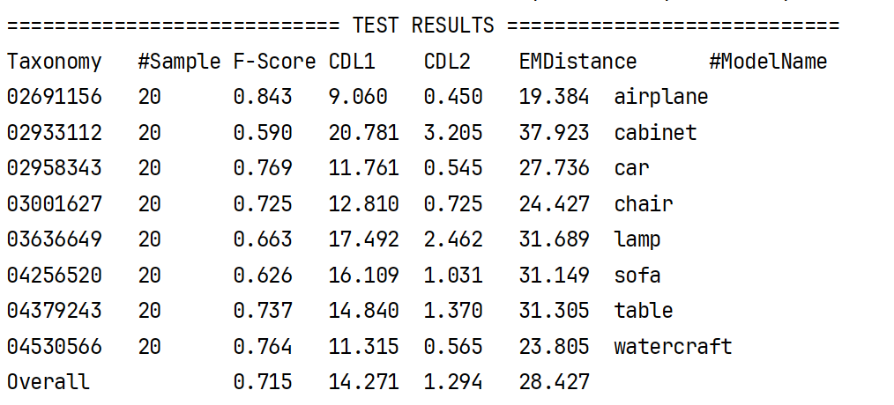

# 251218汇报

1. 完成模型总体架构图

2. 参考SnowflakeNet的点云生成模块，主要是在生成的种子点之后，通过雪花反卷积（SPD）逐步增加点的数量。

改进前

改进后

发现第二类的**CDL2**和**CDL1**变好了**0.48**和**0.16**左右，其余都是自己的模型效果更好，后续再继续调整改进试试。

3. 基于官方数据集的模型一直在跑，抽样每类数据集抽样1/5，一共8类，预计跑150轮简单模型也得两天，复杂模型四天。结果来看，有些类也不是特别好。

   有一个原因可能是训练过程开启了EMD的计算，很消耗时间，而且数值看起来结果一般，这个指标可以仅在测试过程开启计算。

   同时考虑更改测试集的残缺程度至大于50%、50%-25%、小于25%，分别计算CD-L1-L、CD-L1-M、 CD-L1-H 。让结果更丰富。

