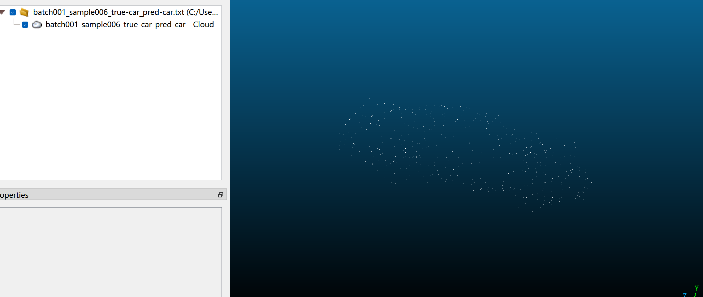
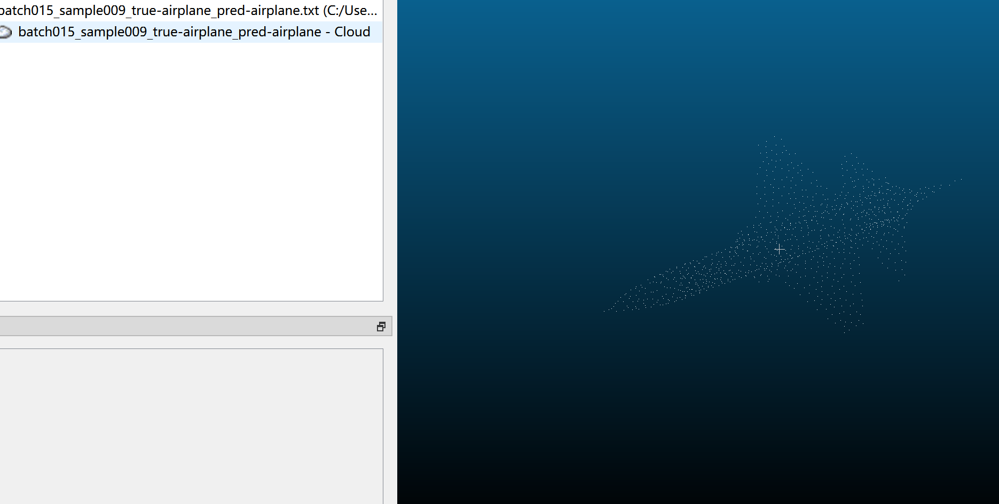
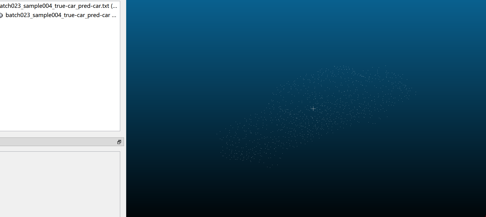

# 1. 点云分类论文

输入：点云坐标，打包储存成H5格式

输出：对每种输入点云输出物体类别

# 2. 自动驾驶点云分类检测论文
输入：.bin文件，储存激光雷达生成的点云数据，图像数据可以作为辅助输入

输出：对于每个检测到的物体（如车辆、行人），输出其 3D 位置（中心坐标）、尺寸（长、宽、高）、方向（朝向角度）以及对应的置信度分数，表示检测结果的可信度。数据格式为文本文件 (.txt)，每行对应一个检测到的物体，包含其类别、位置、尺寸、方向和置信度分数等信息。可视化结果：点云 2D图像上叠加显示检测框，标注类别名称。

