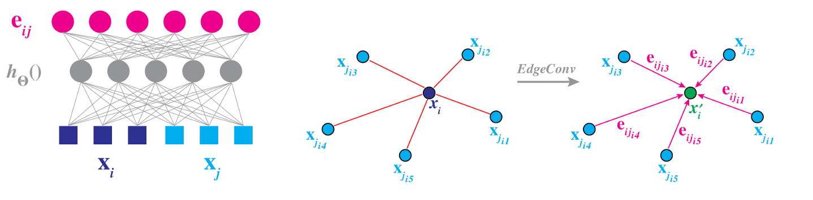
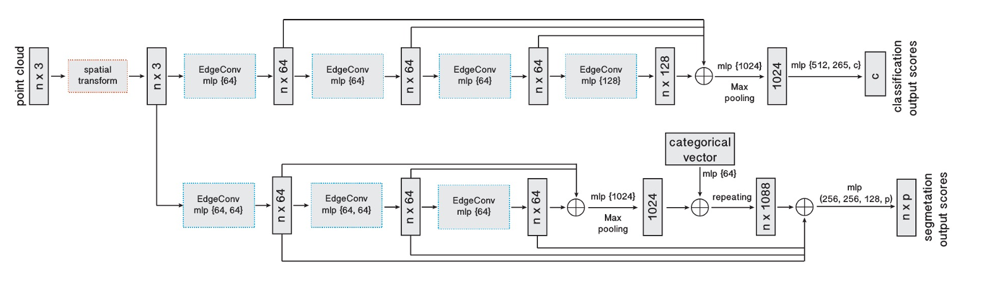
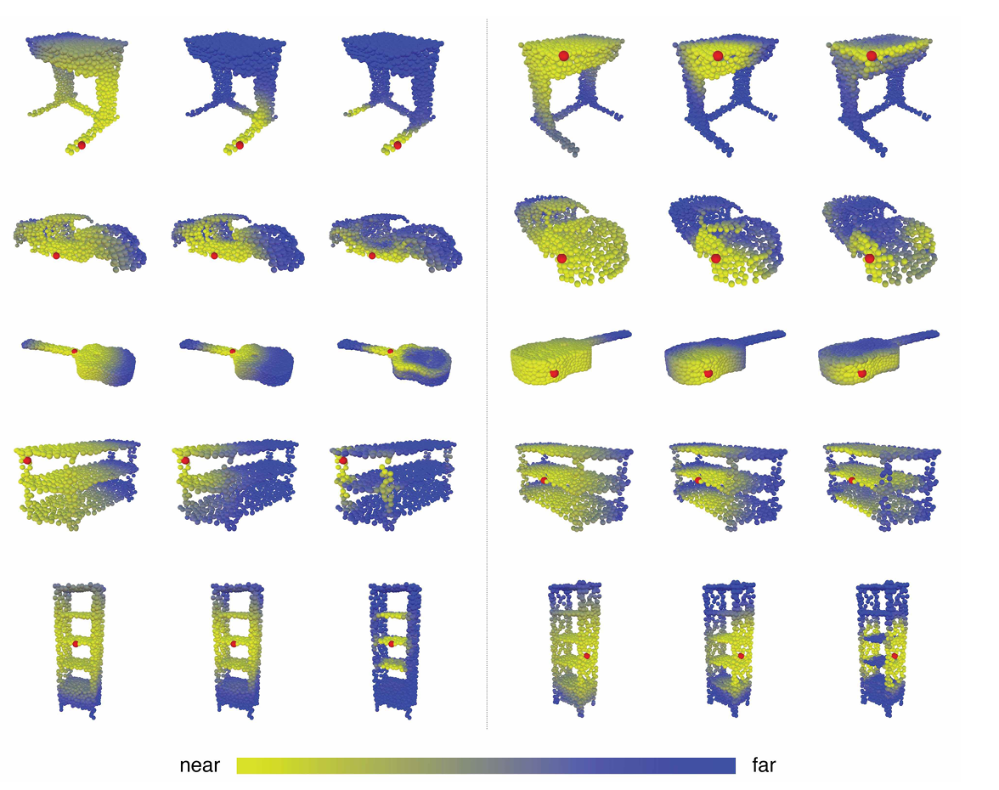
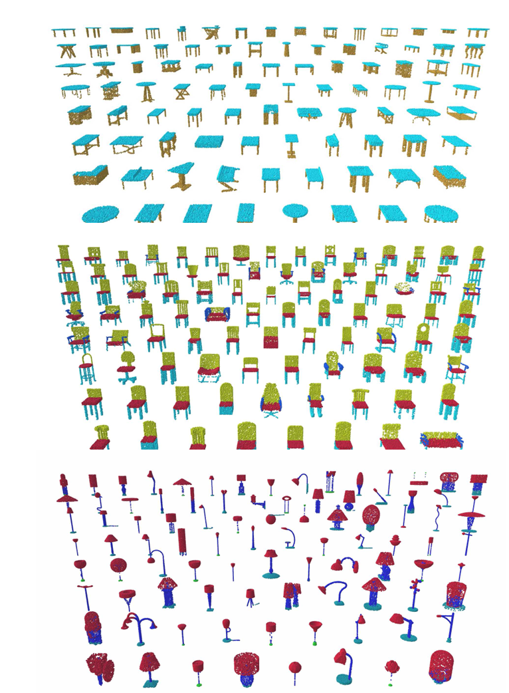

# 周报
## 1. 论文阅读
  Dynamic Graph CNN for Learning on Point Clouds [paper](https://arxiv.org/pdf/1801.07829)

特征聚合：通过边特征聚合更新得到点的新特征。EdgeConv操作会在点云中构建一个局部邻域图，每个点都会与其k个近邻点相连。中心点通过邻点边特征的特征聚合操作(相加或者取最大值)，生成新的点特征。

main architectures:

结果：

  
 
## 2. 代码复现
    
## 3. QT学习
   《QT5+opencv3》目前进度1/3
