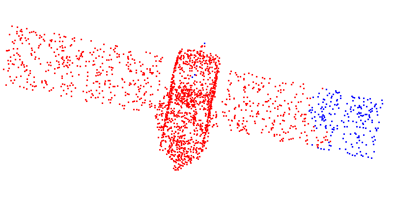
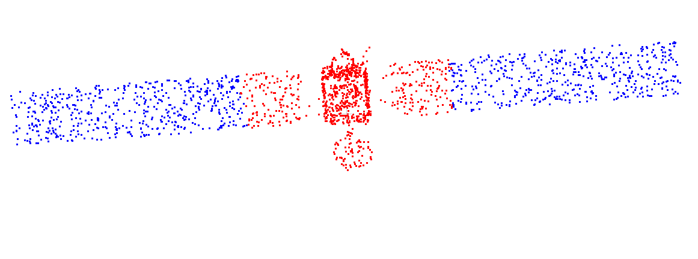
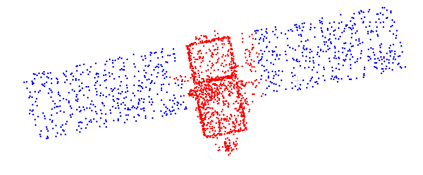
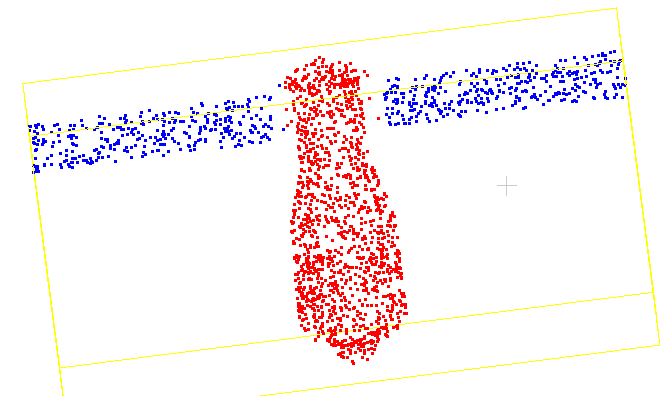
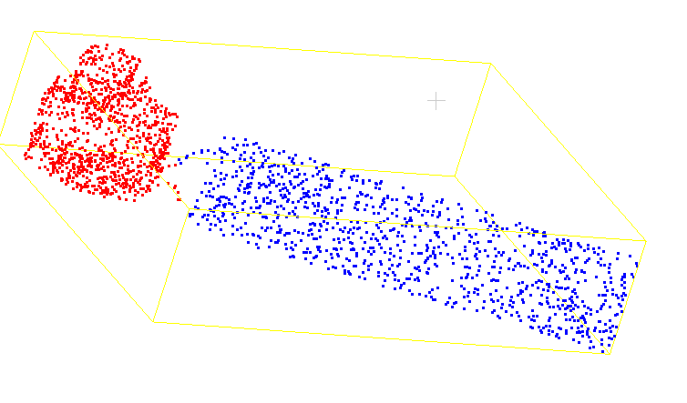
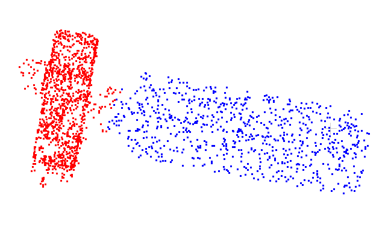
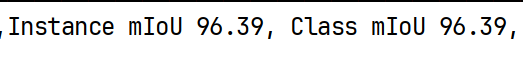

## 组会2026.3.11

### 1. 综述-点云分割任务   [论文](https://arxiv.org/pdf/2405.11903)

| 类别          | 代表模型               | 核心技术与特点                                               |
| ------------- | ---------------------- | ------------------------------------------------------------ |
| 经典架构      | PointNet               | 首次利用共享MLP和对称函数（Max-pooling）处理无序点云，解决了**置换不变性**。 |
|               | PointNet++             | 引入层次化结构，通过集抽象（SA）层捕捉局部几何结构，是PointNeXt的直接原型。 |
| 卷积类        | PointCNN               | 提出 X 变换（X-transformation），通过重加权和排序使规则卷积能处理不规则点云。 |
|               | KPConv                 | 使用核点进行灵活且可变形的点卷积，在处理大规模室内外场景时表现稳健。 |
| 图网络类      | DGCNN                  | 采用动态图卷积（EdgeConv），在特征空间动态构建邻域图以捕捉拓扑关系。 |
|               | DeepGCNs               | 引入残差连接和空洞卷积，使图卷积网络可以堆叠到极深（达1000层）而不会退化。 |
| Transformer类 | Point Transformer      | 基于矢量自注意力（Vector Self-attention）机制，能高效捕捉长程依赖关系。 |
|               | Stratified Transformer | 采用分层采样策略捕捉多尺度上下文，在ScanNet等大型数据集上表现优异。 |
| MLP类         | PointMLP               | 纯残差MLP架构，证明了无需复杂模块，仅靠训练策略也能达到极高精度。 |
|               | PointNeXt              | 引入倒置残差瓶颈（InvResMLP）和可分离MLP，结合现代训练策略实现高效缩放。 |

**经典架构**：这是所有点云任务的起点，适合作为基础对比。

**基于卷积的类别**：在 3D 空间寻找像 2D 图像一样的“局部规则性”，在场景分割上效果比较好

**基于图的类别**：结构简单，比如说DGCNN利用的是KNN，关注的是点与点之间的“亲疏关系”。可以考虑做backbone

**基于 Transformer 的类别** ：模型一般都比较复杂，更适合复杂的语义分割。对于几何结构相对固定的卫星模型，感觉用特征聚合就足够了。

**MLP 类**：利用简单的 MLP 就能在部件分割上拿到 SOTA 结果，可以考虑做backbone

对比跑了卷积类和MLP的模型，结果都差不多，着重在以下模型中作更改：

### 2. PointNeXt：

之前做的数据集里面的卫星都比较杂乱，因为这个任务是接在点云补全任务之后，我现在统一整理了手头上的单/双叶卫星，重新制作数据集，总共50（40train/10val）个，模型数量偏少。

一开始测试感觉效果不是很好，训练过拟合，考虑原因：数据量太少、训练轮数太多

​                                                                                                             分割结果较差

针对数据量过少导致过拟合问题，采用数据增强：

**随机缩放 (PointCloudScaling)**：在每一次抓取点云时，系统会随机生成一个比例系数（例如 0.9 到 1.1 之间），对点云的 X、Y、Z 坐标同时进行拉伸或压缩。

**随机坐标抖动 (PointCloudJitter)**：向点云中每一个点的 X、Y、Z 坐标分别加入微小的、符合高斯分布的随机噪声（毫米级别）。

**特征随机丢弃 (ChromaticDropGPU)**：在特征维度（法向量或高度）上，以一定概率随机将部分点的特征值直接置为 0。

几何空间增强（缩放、抖动）是 100% 触发但强度随机的，以保证每次的空间形态都不重样；而特征抹零则是基于参数p按概率触发的

参考采用以上三种数据增强之后，epoch降到100轮，测试结果好了很多：

### 下一步计划

1. 再做适当的结构调整，提高精度
1. 单做单叶、双叶的卫星的分割任务会不会太简单了？因为用了数据增强，可以考虑把现有的复杂卫星模型都放进数据集