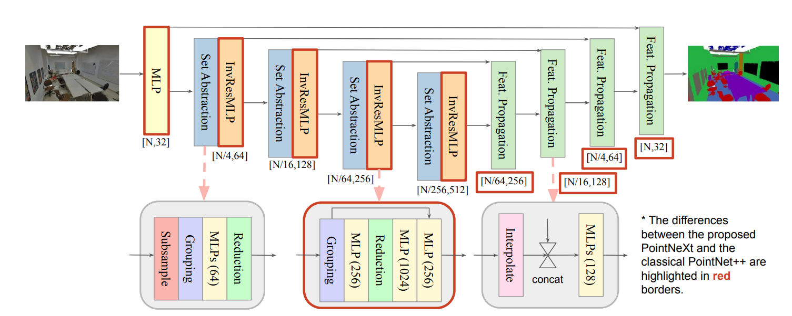
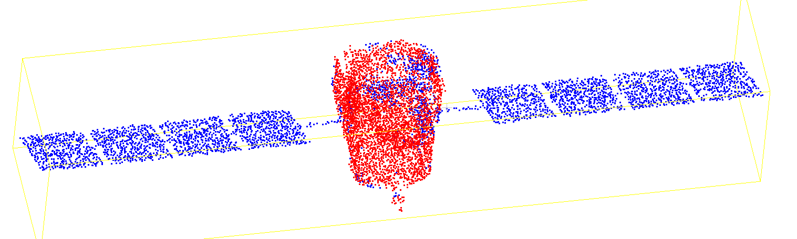
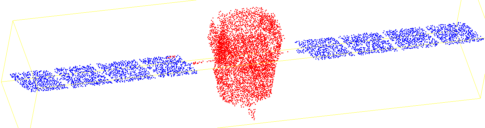
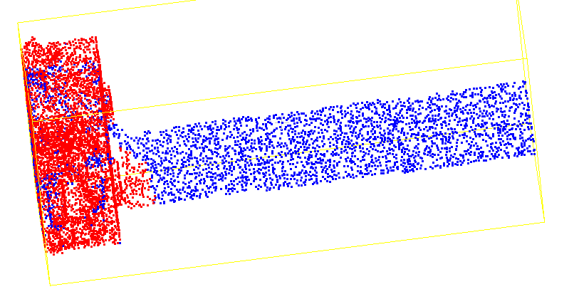
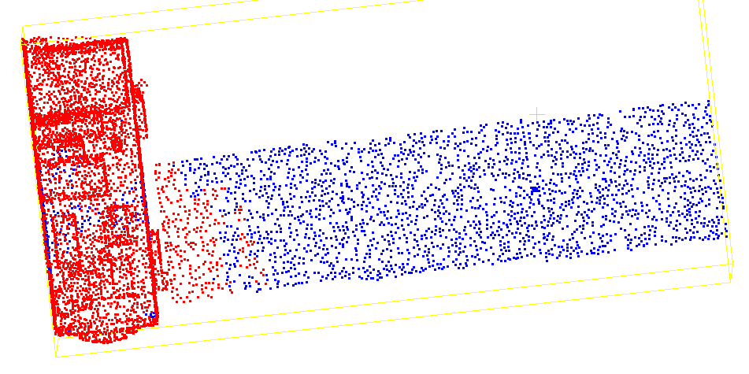
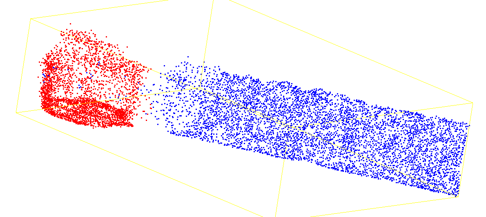
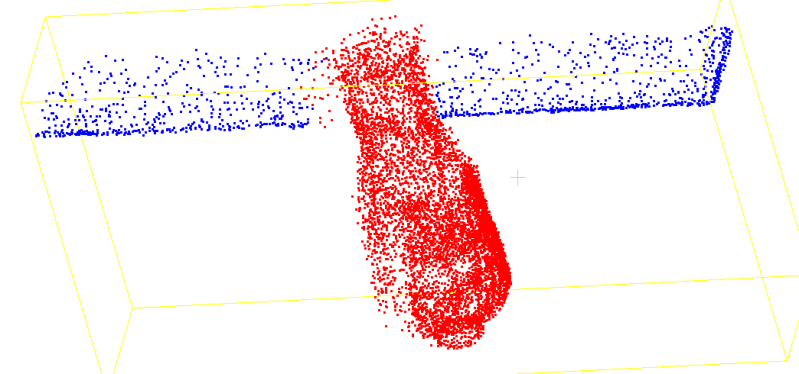
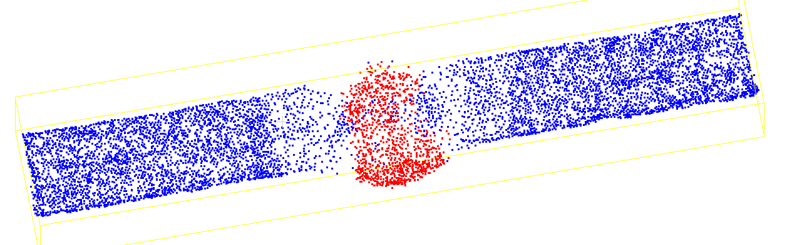
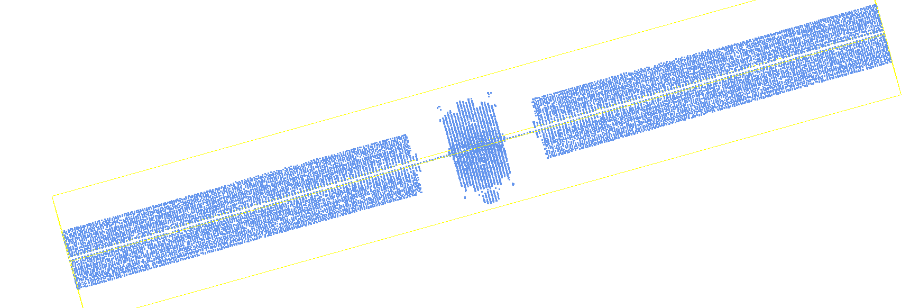

## 周报3.25

上次仅仅在训练策略上加了一个数据增强的部分，分割结果还算可以。

#### 想法：

前期的Transformer 的点云补全模型已经用了很大的规模来提取全局特征，而现在的模型PointNeXt是仅仅用了MLP来进行降采样上采样，提取局部特征，我的想法是引入前期训练好的 Transformer 的点云补全模型，将其作为特征提取器，提取高维全局特征，并与 PointNeXt 的局部特征进行多尺度融合。

实现： 加载预训练的 Transformer 补全网络，提取出 **1024 维** 的全局特征，与PointNeXt 提取的细粒度局部特征进行拼接。

#### **实验对比结果**：

Instance mIoU 均达到了 **93.81%**，相较于纯 PointNeXt（89.95%）有跨越式提升。

纯局部网络在处理局部几何相似的区域时容易产生误判。本次引入的 1024 维全局先验强行施加了宏观形状约束，有效纠正了由局部相似性导致的预测飞点和语义错误。

#### 尝试在我补全后的点云进行分割：

#### SpaceSense-Bench数据集：

1. 这个数据集当中的点云是残缺不完整的，由于遮挡原因，通过雷达扫描出来的点是不完全的。但是其提供了每一帧的相机、服务航天器和目标航天器的位置与四元数（位姿）。利用`target_spacecraft_in_camera_pos`（位置）和四元数（姿态）构建了一个变换矩阵 **T**, 取这个矩阵的逆矩阵。

2. 根据每帧的点云和矩阵得到同样姿态的点云，再进行拼凑。对于拼凑好的点云下采样至标准输入点数。

3. 后续再进行分割任务的预处理，把这些卫星数据都用上

   