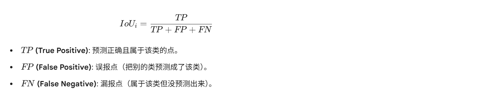
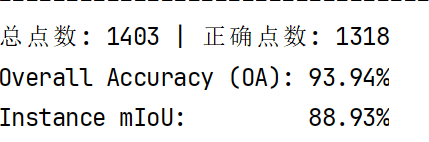
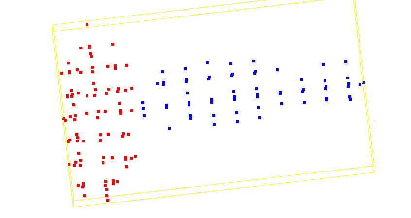
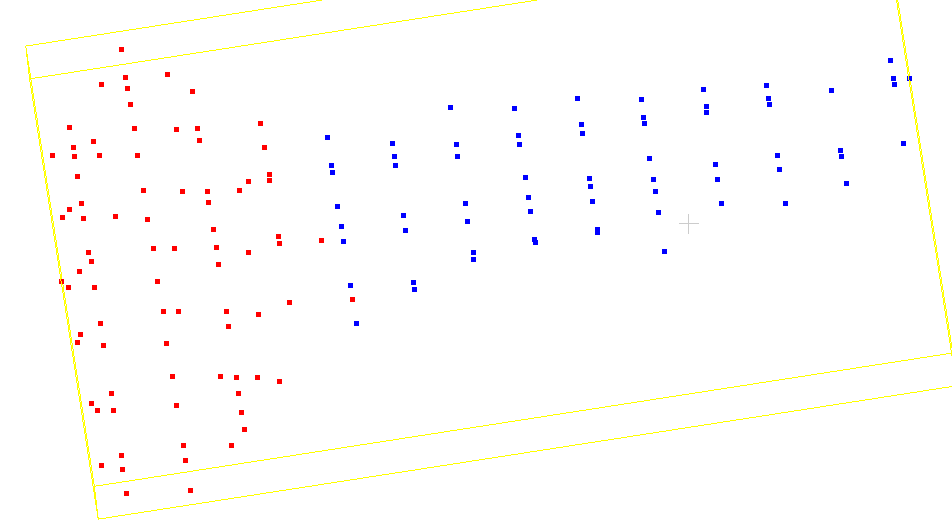
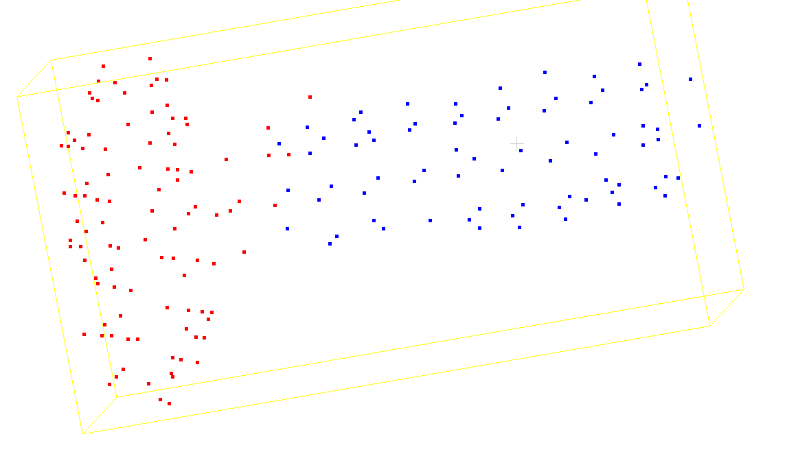
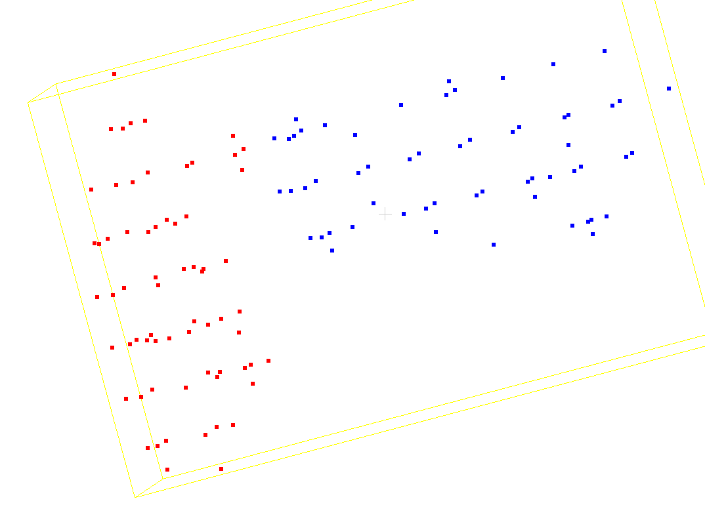
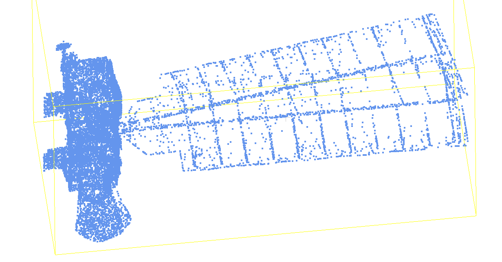
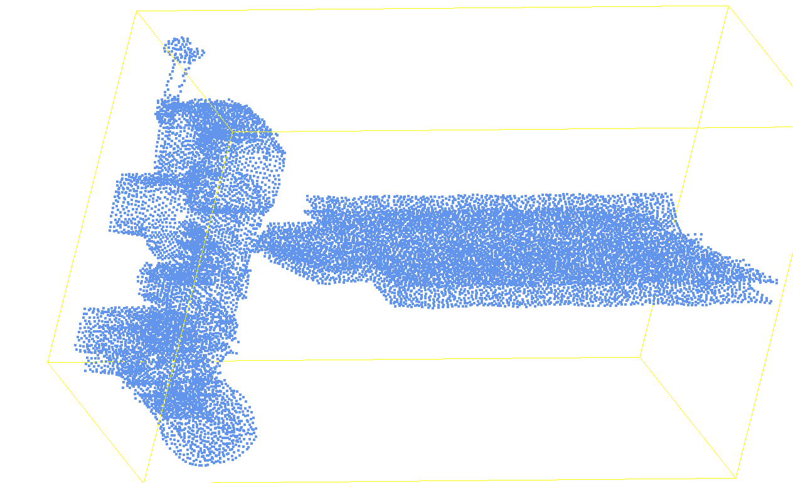
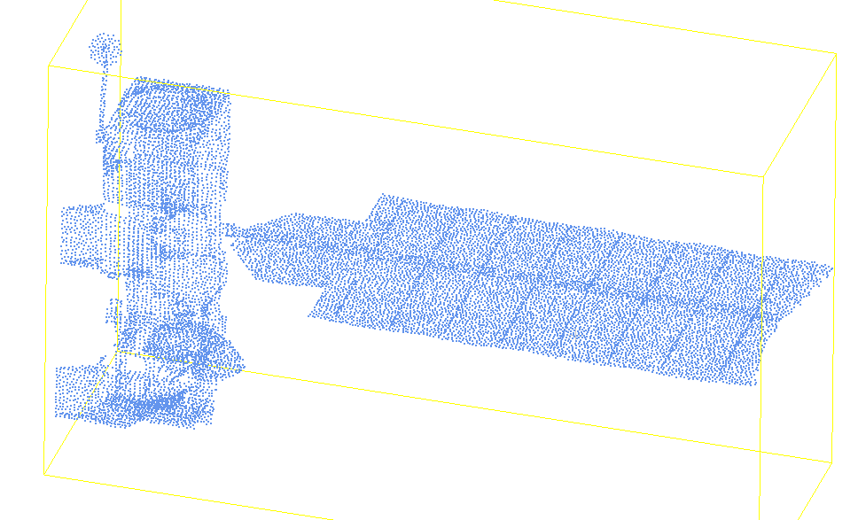
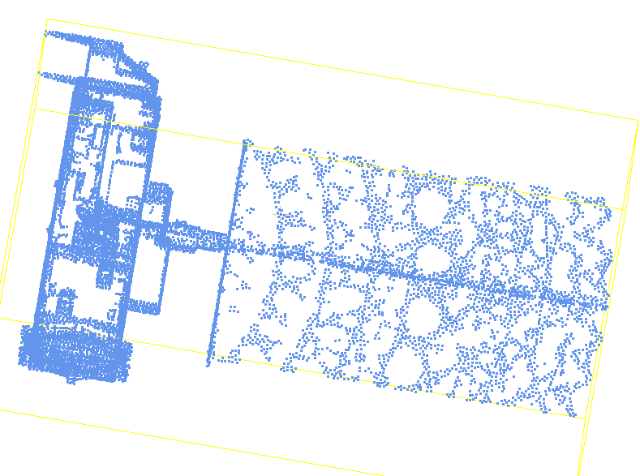

### PointNeXt 稀疏点云分割

#### 评估指标：

**OA (Overall Accuracy) 全局准确率**：模型预测正确的点数占总点数的比例。

**Shape IoU (交并比)**：IoU 衡量的是“预测区域”与“真实区域”的重叠程度。

模型使用 2048 点的密集数据训练，但实际测试的 PLY 文件仅包含 120-180 个点。由于训练、推理密度不匹配，分割效果极差：

**初始 OA 仅 53%，mIoU 仅 31%**。

#### 归一化：训练数据本身已归一化， 测试数据未归一化，测试脚本中统一使用"中心化 + 单位球"，推理后还原。

#### 扩充数据集：**31 → 465 训练样本**

| 增强手段        | 参数            |
| :-------------- | :-------------- |
| 随机 Y 轴旋转   | 0 ~ 360°        |
| 随机 X/Z 轴倾斜 | ±15°            |
| 随机缩放        | 0.7 ~ 1.3       |
| 随机平移        | ±0.15           |
| 随机丢点        | 保留 50% ~ 100% |

训练＋推理过程：

| 版本 |     OA     | Instance mIoU | mIoU 提升 |
| :--: | :--------: | :-----------: | :-------: |
|  V0  |   53.39%   |    31.42%     |     —     |
|  V1  |   58.37%   |    37.89%     |   +6.5    |
|  V2  |   91.16%   |    84.58%     |   +46.7   |
|  V3  | **93.94%** |  **88.93%**   |   +4.4    |

| 测试文件 | V0 IoU | V2 IoU | **V3 IoU** | 提升  |
| :------- | :----: | :----: | :--------: | :---: |
| from06   | 34.0%  | 100.0% | **88.4%**  | +54.4 |
| from08   | 26.0%  | 83.9%  | **94.3%**  | +68.3 |
| from07   | 53.4%  | 78.8%  | **95.8%**  | +42.4 |
| from09   | 92.2%  | 86.5%  | **93.7%**  | +1.5  |
| from04   | 22.9%  | 94.8%  | **85.2%**  | +62.3 |
| from03   | 23.8%  | 90.0%  | **91.1%**  | +67.3 |
| from02   | 79.2%  | 80.3%  | **91.6%**  | +12.4 |
| from05   | 80.4%  | 84.5%  | **85.7%**  | +5.3  |
| from01   | 16.5%  | 62.4%  | **74.6%**  | +58.1 |

#### **扩充原始数据集遇到的问题**

重叠、角度对应不上，导致最后拼成的完整点云有问题：

后面发现是坐标系的问题：

UE5 使用的是左手坐标系 X 轴朝前，Y 轴朝右，Z 轴朝上）；而 Python 代码依赖的 `Scipy` 和 `Open3D` 全部遵循数学界标准的右手坐标系。

